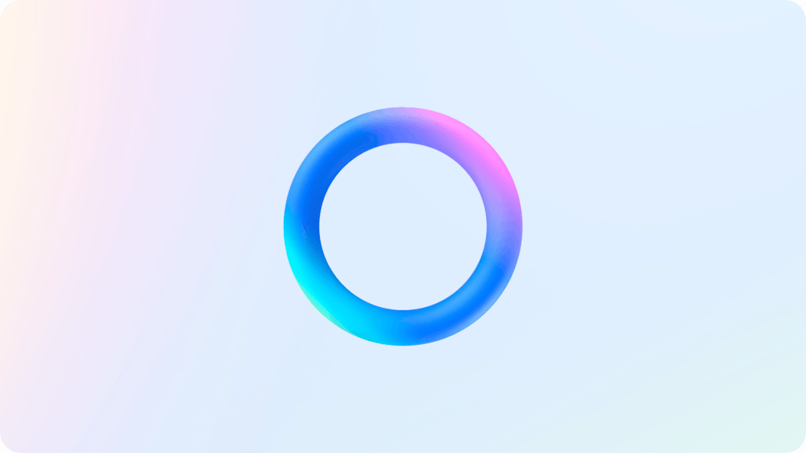

---

# AI Voice Assistant Project



## Overview
This project is an AI-based voice assistant application that merges a Flask backend for AI functionality with a React.js frontend to deliver a stunning, interactive user experience. The app employs **glassmorphism** as its core design aesthetic, creating a modern, sleek, and elegant interface. Users can interact with the assistant via text or voice, and the application supports seamless audio playback and multi-language functionality.

---

## Directory Structure

```
├── backend
│   ├── .env                 # Environment variables
│   ├── app.py               # Flask application entry point
│   └── requirements.txt     # Python dependencies
│
├── frontend
│   ├── node_modules         # Node.js dependencies
│   ├── public               # Static files (e.g., index.html)
│   │   └── favicon.ico      # App icon
│   └── src                  # Frontend source code
│       ├── components       # Reusable React components
│       │   ├── AudioVisualizer.css  # Styles for audio visualizer
│       │   ├── AudioVisualizer.jsx  # Audio visualizer logic
│       │   ├── Chat.css             # Chat interface styles (glassmorphic theme)
│       │   ├── Chat.jsx             # Chat interface logic
│       │   ├── ChatInputWidget.css  # Glassmorphic chat input widget styles
│       │   ├── ChatInputWidget.jsx  # Chat input widget logic
│       │   ├── CustomOrb.css        # Custom animations styles
│       │   ├── CustomOrb.js         # Orb animations logic
│       │   ├── LanguageSelector.css # Glassmorphic language selector styles
│       │   ├── LanguageSelector.jsx # Language selector logic
│       │   ├── Title.css            # Title component styles
│       │   └── Title.js             # Title component logic
│       │
│       ├── store                   # State management
│       │   ├── useSpeechStore.js    # Global state for speech functionality
│       │   └── useLanguageStore.js  # Global state for language selection
│       │
│       ├── App.css                 # Main app styles (glassmorphic)
│       ├── App.js                  # Main app component
│       ├── index.css               # Global styles
│       ├── index.js                # React DOM entry point
│       ├── logo.svg                # Application logo
│       └── reportWebVitals.js      # Performance monitoring
```

---

## Key Features
- **Interactive Chat**: Real-time text and voice interaction with the assistant.
- **Glassmorphism Theme**: A visually appealing design with translucent, blurred elements and frosted glass effects.
- **Audio Playback**: AI-generated responses are played back seamlessly in the app.
- **Language Selector**: Easily switch between multiple languages.
- **Audio Visualization**: Dynamic visuals provide feedback for audio interactions.

---

## Installation

### Prerequisites
- **Node.js** (Latest LTS version)
- **Python 3.x**

### Steps
1. **Clone the Repository**:
   ```bash
   git clone <repository-url>
   cd <repository-name>
   ```

2. **Set Up Backend**:
   ```bash
   cd backend
   python -m venv venv
   source venv/bin/activate  # On Windows: venv\\Scripts\\activate
   pip install -r requirements.txt
   ```

3. **Set Up Frontend**:
   ```bash
   cd ../frontend
   npm install
   ```

4. **Add Environment Variables**:
   Create a `.env` file in the `backend` directory with configuration details (e.g., API keys).

5. **Run the Application**:
   - **Backend**: `python app.py`
   - **Frontend**: `npm start`

---

## Roadmap
- **Enhanced Animations**: Introduce dynamic UI animations for improved interaction.
- **Extended Language Support**: Add support for more languages.
- **Cloud Deployment**: Deploy the app using AWS, Azure, or similar services.

---

## Design Philosophy: Glassmorphism
The app's frontend employs **glassmorphism**, characterized by:
- Translucent cards and input fields.
- Frosted glass effects with blurred backgrounds.
- Subtle gradients and soft shadows to create depth and elegance.

---

## License
This project is licensed under the MIT License.
